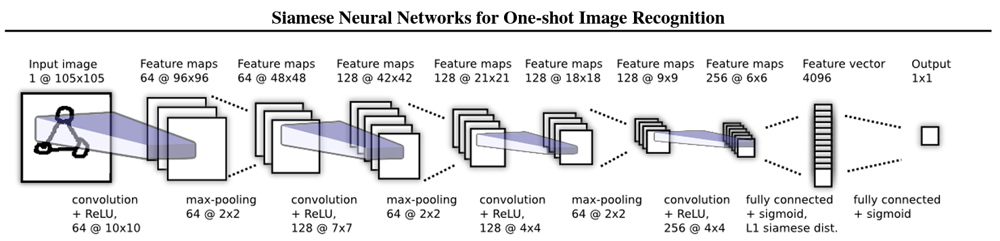
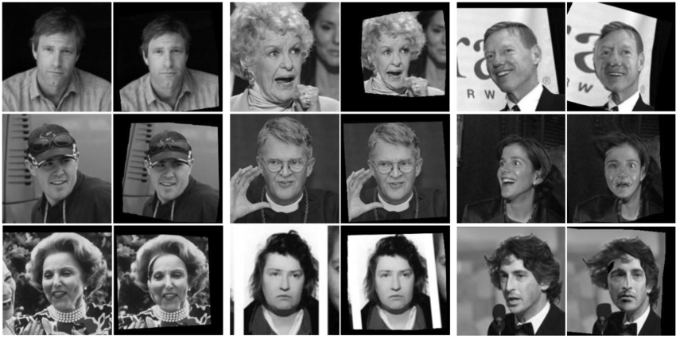

# Face-Recognition-using-Siamese-Neural-Networks
Utilizing Convolutional Neural Networks (CNNs) for Face Recognition via One-shot Classification.

This project applies the principles outlined in the paper ["Siamese Neural Networks for One-shot Image Recognition"](https://www.cs.cmu.edu/~rsalakhu/papers/oneshot1.pdf), authored by Gregory Koch, Richard Zemel, and Ruslan Salakhutdinov.

## Table of Contents :clipboard:
  * [Introduction](#Introduction-bookmark_tabs)
  * [Goals](#goals-dart)
  * [Data Description](#data-description-bar_chart)
  * [Pre-processing Stage](#pre-processing-stage-broom)
  * [Network Architecture](#network-architecture-hammer_and_wrench)
  * [Experimental Configuration](#experimental-configuration-gear)
  * [Experimental Results](#experimental-results-chart_with_upwards_trend)
  * [Experimental Visualizations](#experimental-visualizations-art)

## Introduction :bookmark_tabs:

## Goals :dart:
The primary objective is to successfully execute a one-shot learning task for previously unseen objects. By providing two facial images of unfamiliar individuals, the architecture should reliably distinguish whether the images depict the same person.

## Data Description :bar_chart:
Network performance and evaluation were done on the ['Labeled Faces in the Wild-a (LFW-a)'](https://talhassner.github.io/home/projects/lfwa/index.html) dataset, which is a collection of 250x250 pixel grayscale images of labeled face images intended for studying face recognition. The dataset contains 2,200 training images and 1,000 test images.

## Pre-processing Stage :broom:
Initially, several operations were conducted to prepare the dataset:

- Uploading the data to a cloud storage service and importing it into the development environment.
- Reading the training and test set text files.
- Generating pairs of image paths for both same-class (identical) and different-class (non-identical) pairs.
- Loading the images from their paths and constructing a DataFrame where each entry contains a pair of images and their corresponding label. The labels were assigned as 1 for images of the same class (identical) and 0 for images of different classes (non-identical).
- Additionally, image normalization was performed by dividing each pixel value by 255.

The provided training and test datasets are organized as follows:

**Training set:** Consists of 2,200 samples, each comprising a grayscale image measuring 250x250 pixels. The initial 1,100 samples in the training set depict images of the same individual, while the subsequent 1,100 samples consist of pairs of images depicting two different individuals.

**Validation set:** To evaluate the model's performance during training and optimize hyperparameters, a subset of 440 samples was reserved from the original training set to create a validation set.

**Test set:** Comprises 1,000 samples, each representing a grayscale image with dimensions of 250x250 pixels. The first 500 samples in the test set portray images of the same individual, while the remaining 500 samples consist of pairs of images depicting two different individuals.

**Data Augmentation:** Given the limited size of the dataset available for training, it is essential to enhance the dataset to facilitate effective neural network training. To address this, data augmentation techniques were utilized. Transformations such as RandomHorizontalFlip(), RandomVerticalFlip(), and RandomRotation() were applied to each image in the training set. This process effectively augmented the training set, doubling its size, while maintaining the integrity and correctness of the images.

## Network Architecture :hammer_and_wrench:
The network comprises 5 blocks of convolutional layers, where each followed by BatchNorm, ReLU activation function and MaxPool of 2x2. Additionally, the network includes 2 fully connected layers with sigmoid activation.

- Convolution layer with 64 filters of 10x10.
- BatchNorm(64) + ReLU + MaxPool of 2x2.
- Convolution layer with 128 filters of 7x7.
- BatchNorm(128) + ReLU + MaxPool of 2x2.
- Convolution layer with 128 filters of 4x4.
- BatchNorm(128) + ReLU + MaxPool of 2x2.
- Convolution layer with 256 filters of 4x4.
- BatchNorm(256) + ReLU + MaxPool of 2x2.
- Convolution layer with 256 filters of 7x7.
- BatchNorm(256) + ReLU + MaxPool of 2x2.
- Fully connected layer of 2,304 in-features and 4,096 out-features + Sigmoid.
- Fully connected layer of 4,096 in-features and 1 out-feature + Sigmoid.

## Experimental Configuration :gear:
-	The network consists of 5 convolutional layers followed by 2 fully connected layers.
- Batch size options: [16, 32].
- Loss function: BCELoss. Chosen for its suitability in binary classification tasks.
- Initial momentum: 0.5. Increases linearly in each epoch according to the paper.
- Learning rate options: [0.001, 0.0001].
- Weight decay options: [0.01, 0.1].
- Optimizer: AdamW.
- Maximum epochs: 100.
- Stopping criterion: 10 epochs without improvement in the validation set.

## Experimental Results :chart_with_upwards_trend:
Outlined below are the results of eight experiments conducted with different combinations of batch size [16, 32], learning rate [0.001, 0.0001] and weight decay [0.01, 0.1].

| Exp. # | Batch Size | Learning Rate | Weight Decay | # of Epoches | Train Accuracy | Val Accuracy | Test Accuracy | Avg. Train Cost | Avg. Val Cost | Time (min) |
|---|---|---|---|---|---|---|---|---|---|---|
| 1 | 16 | 0.001 | 0.01 | 37 | 0.907 | 0.766 | 0.683 | 0.202 | 0.542 | 42:06 |
| 2 | 16 | 0.001 | 0.1 | 63 | 0.975 | 0.845 | 0.748 | 0.062 | 0.387 | 72:40 |
| 3 | 16 | 0.0001 | 0.01 | 40 | 0.981 | 0.870 | **0.765** | 0.041 | 0.320 | 47:48 |
| 4 | 16 | 0.0001 | 0.1 | 54 | 0.985 | 0.884 | 0.763 | 0.022 | 0.349 | 63:51 |
| 5 | 32 | 0.001 | 0.01 | 49 | 0.944 | 0.834 | 0.704 | 0.142 | 0.476 | 47:20 |
| 6 | 32 | 0.001 | 0.1 | 73 | 0.988 | 0.884 | 0.748 | 0.044 | 0.363 | 68:15 |
| 7 | 32 | 0.0001 | 0.01 | 44 | 0.982 | 0.882 | 0.747 | 0.038 | 0.329 | 42:12 |
| 8 | 32 | 0.0001 | 0.1 | 40 | 0.981 | 0.870 | 0.755 | 0.045 | 0.346 | 37:44 |

## Experimental Visualizations :art:
